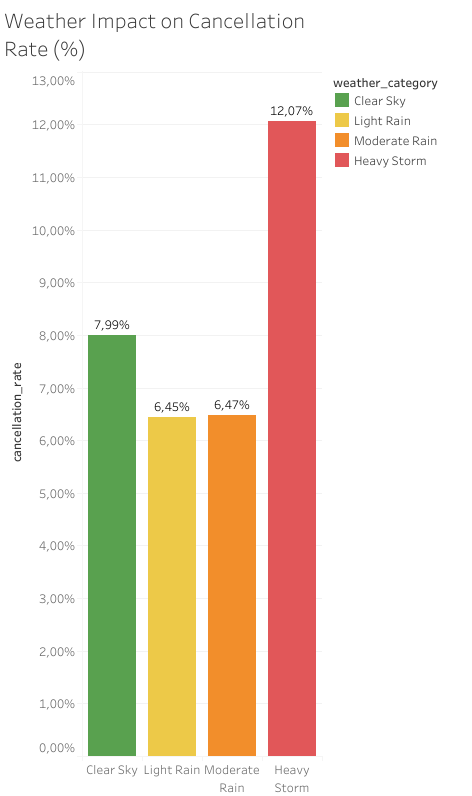
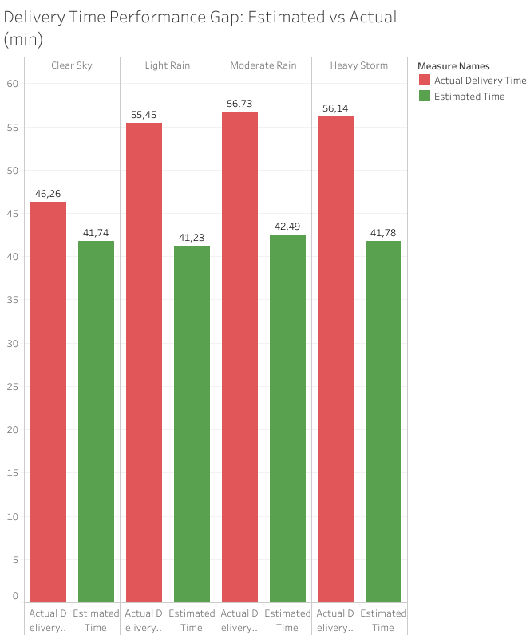
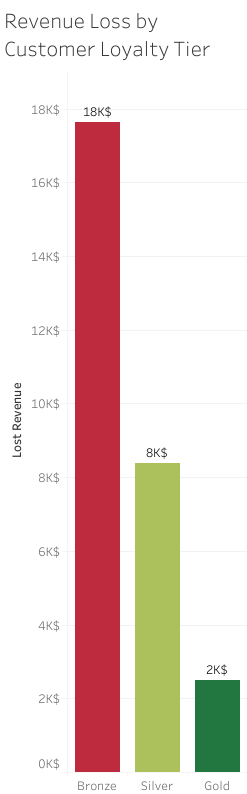
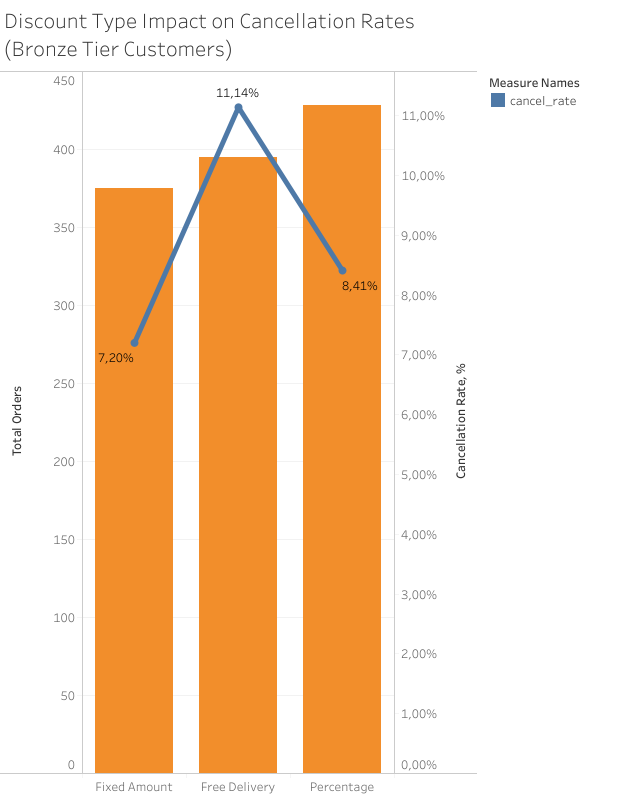

# 🍔 Food Delivery Revenue Analysis

## 🚀 Key Results

- Identified **$28,500 revenue leakage** driven by low-loyalty users  
- Found **14–20 minute delivery delays** during rain and storm conditions  
- Discovered that **discount campaigns increase cancellations** in Bronze segment  

---

## 📌 Project Overview

This project analyzes ~10,000 food delivery orders to identify **operational inefficiencies, revenue leakage, and customer behavior patterns**.

The analysis focuses on how **weather, delivery performance, loyalty tiers, and discounts** impact cancellations and overall business performance.

---

## 🎯 Business Goal

Reduce revenue loss by identifying:
- Key drivers of order cancellations
- Inefficient marketing strategies
- Customer segments with low retention
- Operational gaps in delivery performance

---

## 🧠 Key Insights

### 1. 🌧 Weather Impact on Cancellations
- Cancellation rate increases significantly during **Heavy Storm (12.07%)**
- Compared to **Clear Sky (7.99%)**
- Severe weather directly affects customer behavior

👉 **Impact:** External factors must be integrated into operations

---

### 2. 🚚 Delivery Delay Problem
- In bad weather, actual delivery time exceeds estimated time by **14–20 minutes**
- Customers experience unmet expectations → higher frustration

👉 **Impact:** ETA system is not weather-aware

---

### 3. 🧍 Loyalty Tier Leakage
- **Bronze users generate most revenue loss**
- The issue persists even in good weather → not operational, but behavioral

👉 **Impact:** Problem is retention & engagement, not logistics

---

### 4. 💸 Discount Paradox
- Bronze users with discounts cancel more (**8.93%**) than without (**7.70%**)
- Worst-performing discount: **Free Delivery (11.14% cancellation rate)**
- Best-performing: **Fixed Amount discounts (7.20%)**

👉 **Impact:** Discounts attract low-commitment users instead of improving retention

---

## 📂 Project Structure

```text
food-delivery-revenue-analysis/
├── scripts/                          # SQL analysis scripts
│   ├── 01_weather_impact_analysis.sql
│   ├── 02_delivery_performance_gaps.sql
│   ├── 03_loyalty_tier_profitability.sql
│   └── 04_marketing_efficiency.sql
│
├── data/                             # Dataset description
│   └── dataset_description.md
│
├── visuals/                          # Charts and screenshots
│   ├── weather_cancellation.png
│   ├── delivery_gap.png
│   ├── loyalty_revenue_loss.png
│   └── discount_impact.png
│
└── README.md                         # Project overview and insights
```

---

## 🛠 Tech Stack

- **SQL (PostgreSQL)** — data analysis
- **Excel / Google Sheets** — visualization
- **Notion (optional)** — summary & storytelling

---

## 🚀 Business Recommendations

### 1. Weather-aware operations
- Adjust ETA dynamically based on precipitation levels (>2mm),
increasing delivery estimates by ~10–15 minutes to reduce expectation gaps
- Send proactive delay notifications

---

### 2. Fix delivery expectations
- Increase estimated delivery time during bad weather
- Reduce expectation gap → lower cancellations

---

### 3. Improve Bronze retention
- Introduce incentives for completed orders to move users from Bronze to Silver tier
- Add friction before cancellation ("Are you sure?" prompts)

---

### 4. Rethink discount strategy
- Reduce free delivery campaigns and prioritize fixed-amount discounts,
as they show lower cancellation rates

---

## 📈 Visual Insights

### 1. Weather Impact on Cancellations



- Cancellation rate rises to **12.07%** during **Heavy Storm**
- Compared to **7.99%** in **Clear Sky**

---

### 2. Delivery Delay Gap



- Delivery delay increases by **~14 minutes** during rain and storms
- Clear Sky baseline delay is only **~4.5 minutes**

---

### 3. Revenue Loss by Loyalty Tier



- **Bronze** users generate the largest revenue leakage
- This segment should be the main retention priority

---

### 4. Discount Type Impact on Cancellations



- **Free Delivery** shows the highest cancellation rate
- **Fixed Amount** discounts perform best

---

## 💡 Final Conclusion

The main drivers of revenue loss are:
- External factors (weather)
- Poor ETA accuracy
- Weak loyalty in Bronze segment
- Inefficient discount strategy

👉 Fixing these areas can significantly reduce cancellations and improve profitability.

---

## ⚙️ How to Reproduce

1. Load `data/sample_data.csv` into PostgreSQL as table `food_delivery`
2. Run SQL scripts in order:
   - 01_weather_impact_analysis.sql
   - 02_delivery_performance_gaps.sql
   - 03_loyalty_tier_profitability.sql
   - 04_marketing_efficiency.sql
3. Compare results with provided insights and charts

---

## 📎 Author

Kostiantyn Vovk  
Aspiring Data Analyst | SQL | Data-Driven Decision Making
